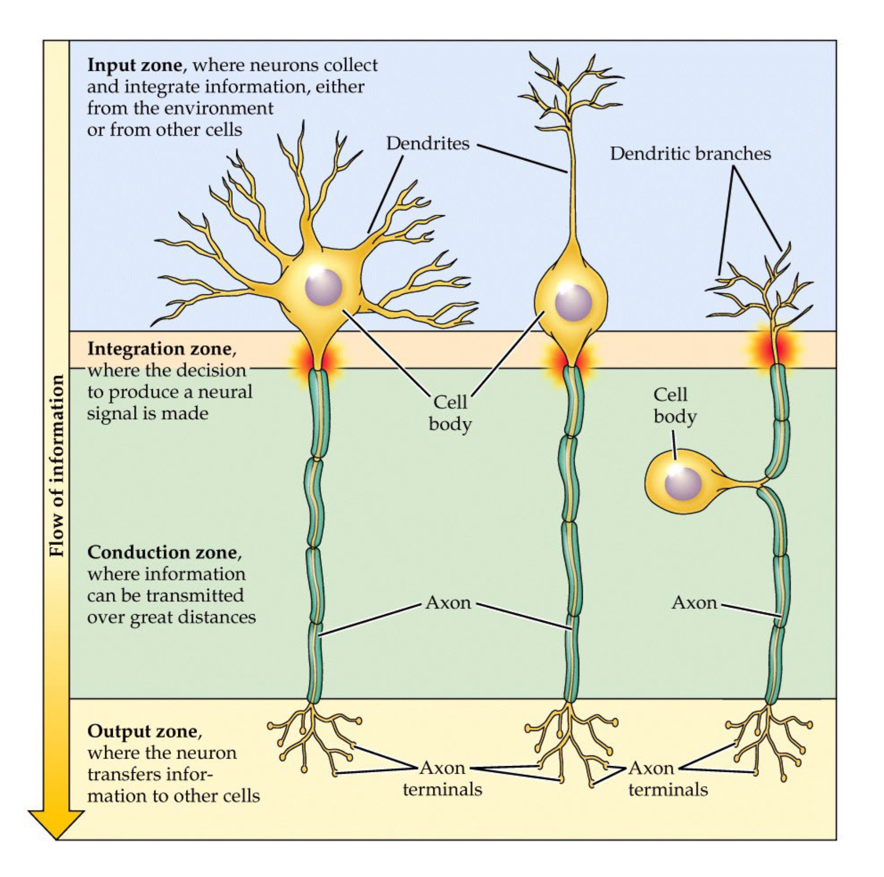
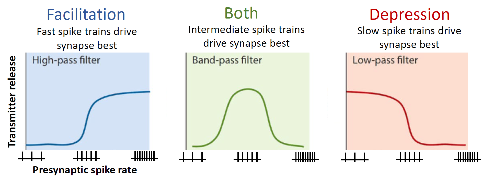
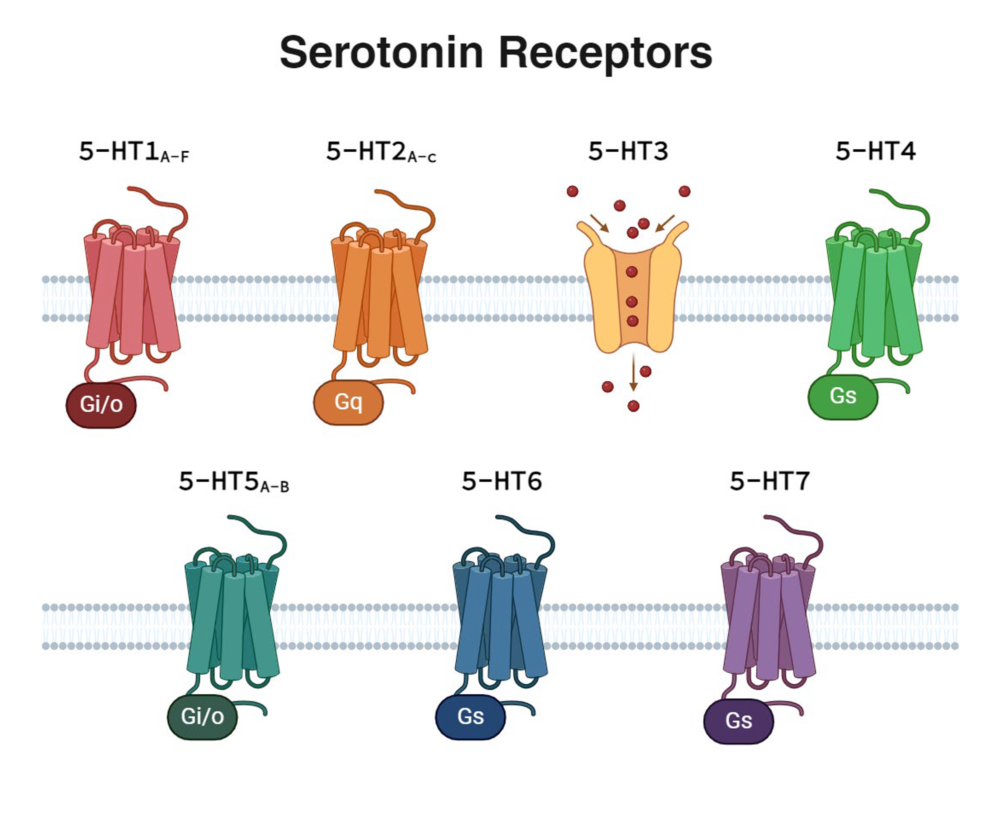
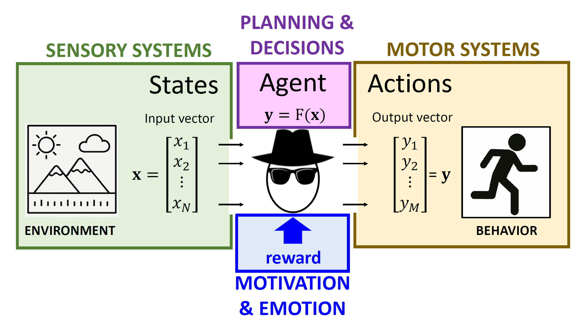
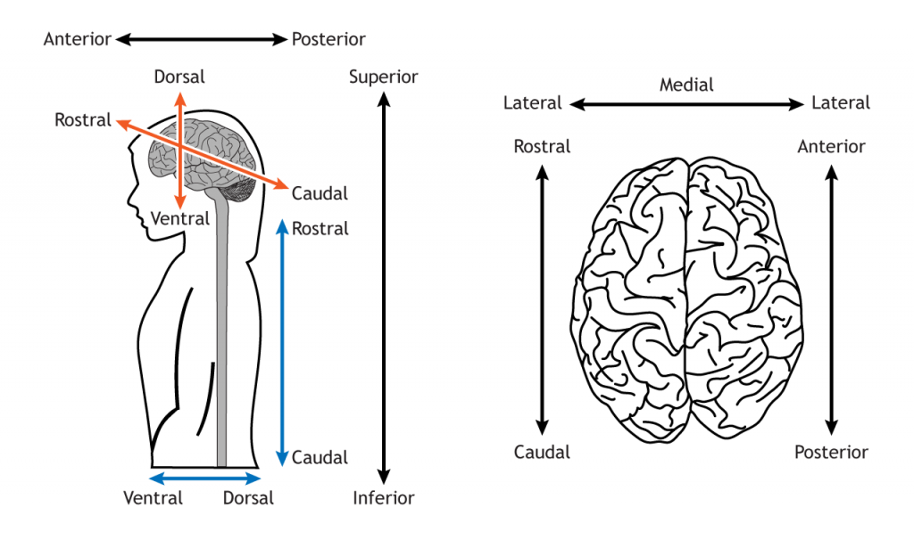
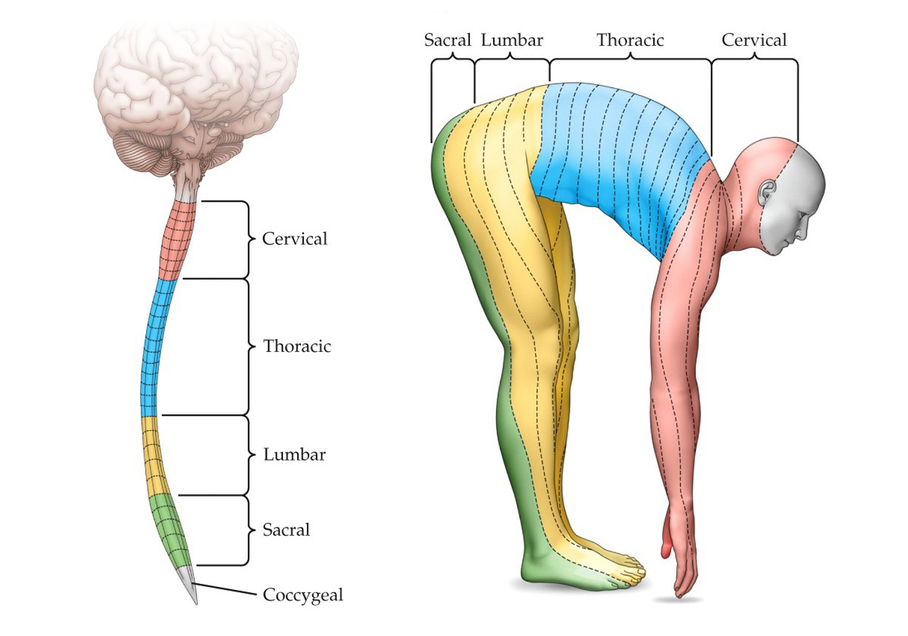
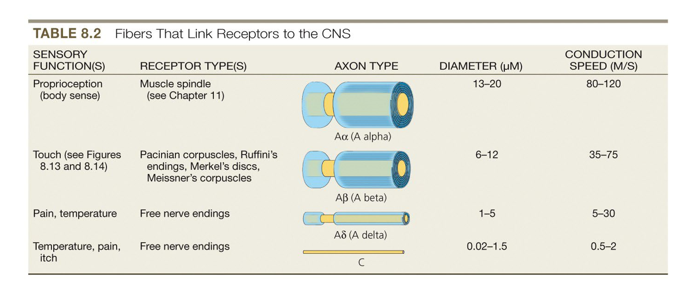
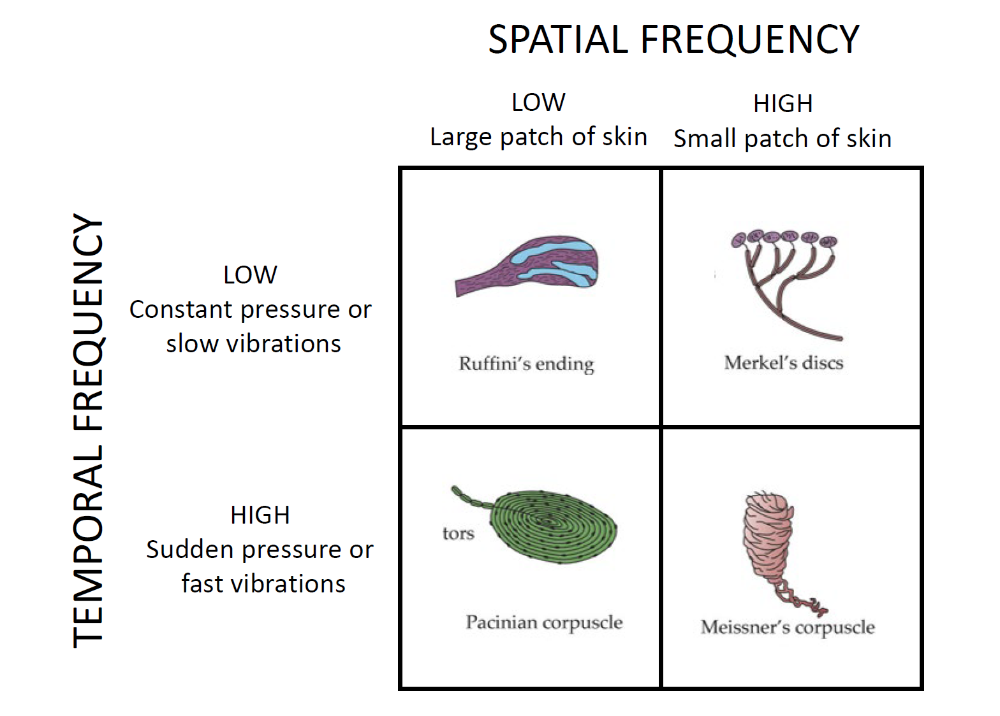

# Lecture 1: Introduction and History

### **Brain as a Neural Network**: the "information processing machine".

#### `Ramon y Cajal's Neuron Doctrine`: neural networks are made of individual neurons.
- Neurons are **discrete**, individual cells with nucleii and membranes.
- Neurons are the **smallest functional unit** of the nervous system.
- Neurons communicate **across synapses** (small gaps).
- Neurons use **unidirectional** signal processing (dendrites > soma > axon terminals).

#### `Warren McCulloch & Walter Pitts`: McCulloch & Pitt's synaptic integration model.
- Synaptic integration is a **mathematical model** to capture neuron behavior.
$$(x_1w_1+x_2w_2+...+x_nw_n)+b=a$$
$$\hat{y}=f(a)$$
- A neuron take in **a list of input parameters** that are always positive ($x_n$).
    - For each input, there's **a weight parameter** ($w_n$).
    - Weight parameters are **adjustable** and can be positive or negative.
- The neuron alwasy has **a bias parameter** ($b$).
    - The bias parameter reflects the **resting potential** of a neuron.
    - When neurons receive no input, its activation ($a$) is **equal to its bias parameter** ($b$).
- For output, the neuron produce only one **activation parameter** ($a$).
    - The neuron then apply activation parameter to an **activation function** ($f()$).
    - The final **output parameter** ($\hat{y}$) equals ($f(a)$).
> Read more about synaptic integration model in [lecture 3](#lecture-3-synaptic-integration).

#### `Donald Hebb & Jerzy Konorski`: hypothesized memory as synaptic plasticity.
- Synaptic plasticity suggests that **information is saved in weights**.
    - Neurons can be **fine-tuned** by adjusting the weight parameters.
> Read more about factors affecting weight parameters in [lecture 3](#lecture-3-synaptic-integration).

#### `Hodgkin, Huxley & Eccles`: biological neural signaling (action potentials).
- Neurons generate rapid **electrical impulses** called action potentials.
- When sender neurons fire, they **release neurotransmitters** to receiver neurons.

#### `Eric Kandel`: biological synaptic plasticity.
- Paired stimulation strengthened related synapses in mollusk aplysia (giant sea slug).

#### `Timothy Bliss & Terje Lomo`: synaptic plasticity in mammals.
- Synapses in mouse/rat hippocampus are also modifiable (related to memory).

#### `Glia Cells`: provide support to neurons, makes up 90% mass of the nervous system.

---
### **Brain-inspired Computing**: the precursor of AI.

#### `Algorithmic Manipulation of Symbols (AMOS)`: computing with complex flowcharts.

#### `Function Approximation with Neurons (FAWN)`: computing with numerous "neurons".
- Neurons are like LEGOs - they're individually very simple, but collectively complex.

#### `Neural Scaling Laws`: the bigger the neural network, the more powerful it is.
- Artificial neural networks are approaching human brain in number of parameters.
- Artificial neural networks are still very inefficient in terms of energy consumption.

# Lecture 2: Transmembrane Voltage

### **Meninges and Cerebrospinal Fluid**:

#### `Meninges`: protective layers around human brain and spinal cord.
- **Dura Mater**: thick outer layer.
- **Arachnoid**: spongy middle layer.
- **Pia Mater**: thin inner layer.

#### `Meningitis`: inflammation of meninges (due to bacterial/viral infection).
- Menignitis can lead to nervous system infections - which can be fatal.

#### `Cerebrospinal Fluid (CSF)`: fluids enclosed within the meninges.
- Neurons first developed action potentials in sea water.
- Land animals enclose their nervous systems in similar environments using CSF.

---
### **The Ventricular System**: a network of brain ventricles.

#### `Ventricles`: hollow tubes and cavities filled with CSF.

#### `Choroid Plexus`: a network of cells that produces CSF, located in the ventricles.

---
### **Transmembrane Voltage in Resting Neurons**:

#### `Voltage`: the difference in net electrical charge.
- Voltage meter measures voltage from positive to negative probes.
    - **Positive voltage**: environment near the *positive* probe is more positively charged.
    - **Negative voltage**: environment near the *negative* probe is more positively charged.

#### `Transmembrane Voltage`: how much more positive is the environment inside the neuron?
$$V_m=C^{in}-C^{out}$$
- Similar to placing the positive probe *inside* and negative probe *outside* the neuron.
    - **Positive transmembrane voltage**: the *neuron* is more positively charged.
    - **Negative transmembrane voltage**: the *CSF* is more positively charged.
- Transmembrane voltage is regulated by the change in *ion concentration*.
    - `Depolarization`: *increase* in transmembrane voltage.
        - Positive ions entering the neuron.
        - Negative ions exiting the neuron.
    - `Hyperpolarization`: *decrease* in transmembrane voltage.
        - Negative ions entering the neuron.
        - Positive ions exiting the neuron.
> See more about depolarization in *excitatory synapses* vs. hyperpolarization in *inhibitory synapses* in [lecture 3](#lecture-3-synaptic-integration).

#### `Monovalent vs. Divalent Ions`: carriers of charges, cause transmembrane voltage.
- **Monovalent Ions**: ions with +1/-1 charge.
- **Divalent Ions**: ions with +2/-2 charge.

#### `Resting Ion Gradients`: resting neurons are slightly **negatively** charged.
||$[Ca]^{2+}$ (Calcium)|$[Na]^+$ (Sodium)|$[K]^+$ (Potassium)|$[Cl]^-$ (Chloride)|Organic Anions (Proteins)|
|---|---|---|---|---|---|
|Concentration *inside* the neuron:|||**Higher**||**Higher**|
|Concentration *outside* the neuron:|**Higher**|**Higher**||**Higher**||
|Which makes the neuron more:|Negative|Negative|Positive|Positive|Negative|
|Transmembrane voltage is now:|-|- -|- - +|- - ++|- - ++ -|
|**Resting voltage**:|||||**-55 to -80 mV**|
|||||||

#### `Chemical Force`: imaginary force that pushes (diffuses) particles from high to low concentration.
- Any given system tends to go from **order to disorder** to maximize entropy.
    - Dissolved particles will naturally diffuse until they're evenly distributed.
    - If there's a **selectively permeable barrier**, only the particles that can pass through will diffuse.
- **Chemical Equilibrium**: particle concentration is the same on both sides.

#### `Electrical Force`: force that pushes ions to oppositely charged reagions (to restore neutral charges).
- $[K]^+$ has higher concentration inside the neuron, but electrical force prevents $[K]^+$ from leaking out.
    - The neuron is already negatively charged, letting $[K]^+$ out will make it even 
- **Electrical Equilibrium**: electrical charge is the same on both sides.

#### `Driving Force`: chemical force + electrical force.
- **Electrochemical Equilibrium**: when the net driving force on a particle is 0.
    - Case 1: both chemical and electrical force is 0 (evenly distributed).
    - Case 2: chemical force cancels out the electrical force (not evenly distributed).

#### `Ion Equilibrium Potentials`: voltage for one type of ion to reach electrochemical equilibrium.
> Note: the term *ion equilibrium potential* is often used interchangeably with `ion reversal potential`.

- Equilibrium potentials are calculated assuming the neuron is **only permeable for the selected type** of ion:

||$[Ca]^{2+}$ (Calcium)|$[Na]^+$ (Sodium)|$[K]^+$ (Potassium)|$[Cl]^-$ (Chloride)|
|---|---|---|---|---|
|Ion Equilibrium Potential:|$E_{Ca}$ = +120 mV|$E_K$ = +60 mV|$E_{Na}$ = -80 mV|$E_{Cl}$ = -90 mV|
|Membrane Permeability:|~0.0%|~7.5%|~92.5%|~0.0%|
- Combined potential is the sum of individual potentials weighted by **relative membrane permeability**.
    - At rest, ~7.5% of the permeating ions are $[Na]^+$, thus its membrane permeability is ~7.5%.
    - At rest, ~92.5% of the permeating ions are $[K]^+$, thus its membrane permeability is ~92.5%.
- Thus, to estimate the **resting potential** of a neuron ($V_{rest}$):
$$V_{rest}=(+60\times7.5\%)+(-80\times92.5\%)=-69.5~mV$$
- Ion equilibrium potentials also corresponds to the voltages during an [action potential](#action-potential-all-or-none-voltage-spike-when-reaching-the-spike-threshold):
    - Potassium ($[K]^+$) potential **(-80 mV)** is similar to the resting potential **(-75 mV)**.
    - Sodium ($[Na]^+$) potential **(+60 mV)** is similar to the peak voltage **(+60 mV)**.

---
### **Ion Gradience Channels**: allows ions to flow through (instead of pumping ions across).
- **Selectively Permeable Channels**: only selected particles can pass through.
    - `Leak Channels`: always open to certain particles.
- **Gated Channels**: only allows particles to pass though under conditions.
    - `Ligand-gated`: open or close when binded to specific molecules.
    - `Voltage-gated`: open or close under specific transmembrane voltages.
    - `Mechanically-gated`: open or close under mechanical forces (e.g. touch).
    - `Optically-gated`: open or close under specific types of light.
- **Maxwell's Demon**: a gated channel that only allows particles to pass in reverse to the concentration.
    - Viewed impossible since it requires the demon to constantly track the concentration.
    - This tracking action will create more entropy in the overall system.

# Lecture 3: Synaptic Integration

### **Neural Compartments**: different parts of a neuron.
- `Synapse`: where neuron connects to its presynaptic neurons.
    - Has leak potassium channels.
    - Has sodium-potassium pumps for repolarization.
    - Has **ligand-gated sodium channels** for neurotransmitters.
- `Soma`: the central cell body.
    - Has leak potassium channels only.
- `Axon` and `Axon Hillock`: where synaptic integration happens.
    - Has leak potassium channels.
    - Has sodium-potassium pumps for repolarization.
    - Has **voltage-gated sodium channels** for initiating action potentials.
- `Synaptic Bouton`: the axon terminal, where neurotransmitters are released.
    - Has **voltage-gated calcium channels**.
    - When channels open, calcium will *enter* the neuron.
> See [axon terminal](#axon-terminal-synaptic-bouton-releasing-neurontransmitters) about the use of calcium channels in releasing neurotransmitters.

---
### **Synaptic Integration Model**: a mathematical model of neuron activities.
> See the [basic definition](#warren-mcculloch--walter-pitts-mcculloch--pitts-synaptic-integration-model)  of McCulloch & Pitts' synaptic integration model from lecture 1.
- A neuron's behavior can be described using **integration functions** and **activation functions**.
$$g(X)=(x_1w_1+x_2w_2+...+x_nw_n)+b\;\;where\;\;X=[x_1,x_2,...,x_n]$$
$$g(X)=(x_1w_1+x_2w_2+...+x_nw_n)+b=a$$
$$\hat{y}=f_{step}(a)\;\;or\;\;y=f_{sigmoid}(a)$$
- $g()$: the `integration function` for *this neuron*
    - Returns in volts.
    - Takes in a list of *positive* presynaptic inputs ($X$) and a bias parameter ($b$).
- $(x_n)$: input from a specific presynaptic neuron to *this neuron*.
    - Measured in neurotransmitter concentration.
    - Must be *greater than or equal to 0*.
    - Corresponds to the *amount of neurotransmitter* received.
- $(w_n)$: *this neuron's* weight to a specific $x_n$.
    - Measured in volts per concentration.
    - Can be positive or negative.
    - Corresponds to *this neuron's* sensitivity to a specific presynaptic input.
- $(b)$: *this neuron's* bias parameter (resting potential).
    - Measured in volts ($v_{rest}$).
    - Can be positive or negative.
    - Corresponds to *this neuron's* resting potential (-55 to -80 mV).
- $(a)$: *this neuron's* output voltage, given all inputs of $x_n$.
    - Measured in volts ($v_{soma}$).
    - Can be positive or negative.
    - Corresponds to *this neuron's* new *soma* voltage after receiving presynaptic inputs.
- $(\hat{y})$: if *this neuron* will fire/release neurotransmitter under the given presynaptic inputs.
    - Measured in binary value.
    - Can be 1 or 0.
    - Corresponds to if *this neuron* will fired/release neurotransmitter (1) or not (0).
- $(y)$: the *rate of fire* for this neuron over a given amount of time (usually 1 second).
    - Measured in hertz.
    - Must be *greater than or equal to 0*.
    - Corresponds to how fast the neuron is firing (thus a positive real number).
- $f()$: the `activation function` for *this neuron*.
    - `Step Activation Function`: if $a$ is above firing threshold, *return 1*; otherwise, *return 0*.
        - *"Frozen in time"*: each $x_n$ is counted as the **amount** of input.
    - `Sigmoid Activation Function`: returns a positive frequency (real number).
        - *"Within a given time"*: each $x_n$ is counted as the **frequency** of input.

---
### **Excitatory vs. Inhibitory Synapses**: is the weight positive or negative?
- `Excitatory Synapses`: **depolarizes** the receiving neuron ($w_n>0$).
    - Cause: `AMPA Receptors` activated by neurotransmitters.
    - Effect: opening ligand-gated channels for *sodium ions* ($Na^+$).
- `Inhibitory Synapses`: **hyperpolarizes** the receiving neuron ($w_n<0$).
    - Cause: `GABA Receptors` activated by neurotransmitters.
    - Effect: opening ligand-gated channels for *cloride ions* ($Cl^-$).
> See [lecture 5](#neurotransmitter-receptors-trigger-excitatoryinhibitory-actions) for more information on receptors.

- **Factors affecting the weight of synapse ($w_n$)**: also relates to [synaptic plasticity and memory](#donald-hebb--jerzy-konorski-hypothesized-memory-as-synaptic-plasticity).
    - **Distance** of the synapse to the *soma*.
        - More distance, less strength (weight).
        - Not easily modifiable (hense contribute less to synaptic plasticity).
    - **Density** of ligand-gated receptor channels.
        - More density, more strength (weight).
        - More density means more ligand-gated channels open at the same time.
    - **Duration** for ligand-gated channels to remain open.
        - More duration, more strength (weight).
        - Depends on rates of **re-uptake** or **catabolism** (see [synaptic vesicles](#synaptic-vesicles-contain-neurotransmitters-ready-to-be-released)).
    - **Driving Force** of the opened channesl (and their ions).
        - More driving force, more strength (weight).
        - If the channels remain opened, driving force will *limit* the voltage change.

> See the [definitions](#transmembrane-voltage-how-much-more-positive-is-the-environment-inside-the-neuron)  of depolarization in excitatory synapses & hyperpolarization in inhibitory synapses.

---
### **Temporal vs. Spatial Summation**: multiple times vs. from multiple synapses.
- `Temporal Summation`: *one* presynaptic neuron fires *multiple times* at once.
    - Voltage changes accumulate from different *temporal* inputs.
- `Spatial Summation`: *multiple* presynaptic neurons fire *simultaneously* at once.
    - Voltage changes accumulate from different *spatial* inputs.

---
### **Action Potential**: all-or-none voltage spike when reaching the spike threshold.
- If voltage reaches the **spike threshold** (typically -55 mV) at the axon hillock:
    - Some sodium ($Na^+$) voltage-gated channels starts to open.
        - Sodium ($Na^+$) starts coming into the neuron, *depolarizing* the neuron.
        - Transmembrane voltage *increases*, opening more sodium ($Na^+$) channels.
        - More sodium ($Na^+$) rushes in, causing an **irriversible positive feedback loop**.
    - Sodium ($Na^+$) voltage-gated channels become **inactive** after opening for a few milliseconds.
        - Sodium ($Na^+$) channels operate in a **close-open-inactive** cycle.
        - Inactive channels will only reset *below the spike threshold* (-55 mV).
- Transmembrane voltage will **reach ion equilibrium potential** for sodium ($Na^+$), at around [+60 mV](#ion-equilibrium-potentials-voltage-for-one-type-of-ion-to-reach-electrochemical-equilibrium).
    - When transmembrane voltage first reaches the **delayed rectifier threshold** (-45 mV):
        - *Delayed* potassium ($K^+$) voltage-gated channels are activated.
        - The delay allows transmembrane voltage to reach its peak (+60 mV).
        - After transmembrane voltage peaked, these potassium ($K^+$) channels will open.
    - As transmembrane voltage climbs to peak voltage, potassium ($K^+$) **will rush out**.
        - Chemical force *always* pushes potassium ($K^+$) to rush out.
        - Electrical force *now also* starts pushing potassium ($K^+$) to rush out.
        - Meanwhile, *delayed channels* for potassium ($K^+$) also starts to open up.
    - Potassium ($K^+$) rush out and hyperpolarize the neuron, causing an **undershoot**.
        - *Delayed* potassium ($K^+$) voltage-gated channels are closed under -45 mV.
        - Potassium ($K^+$) keeps rushing out and hyperpolarize the neuron to -90 mV.
        - Now the neuron is at a new electrochemical equilibrium of -90 mV.
- **Active transporters** (ion pumps) restore the neuron back to *resting state*.
    - `Sodium-potassium Pump (NaK)`: pump 3 *sodium* ions outside and 2 *potassium* ions inside.
    - `Chloride-potassium Pump (KCC2)`: pump both *chloride* and *potassium* outside.

---
### **Refractory Period**: brief period after action potential
- `Absolute Refractory`: during the voltage spike, the neuron **blocks all** post-synaptic potentials.
- `Relative Refractory`: when the neuron is returning to rest, **only very strong** deploarizing signals pass.

# Lecture 4: Signal Propagation in Neurons

### **Classifying Synapses by Location**:
- `Axo-dendridic Synapse`: connects to postsynaptic neuron at its **dendrite**.
- `Axo-somatic Synapse`: connects to postsynaptic neuron at its **soma**.
- `Axo-axonic Synapse`: connects to postsynaptic neuron at its **axon**.

---
### **Classifying Neurons by Anatomy**:
- `Multipolar Neurons`: **many dendrites** connecting directly to the soma *(left)*.
- `Bipolar Neurons`: **only one dendrite** connecting directly to the soma *(middle)*.
- `Pseudounipolar Neurons`: **the axon bifurcates** with one axon functioning as a dendritic branch *(right)*.

> Note: **integration zone** is generally located at the [axon hillock](#neural-compartments-different-parts-of-a-neuron) (except for pseudounipolar neurons).

---
### **Classifying Neurons by Efferent Distance**:
#### `Projection Neurons`: have **long-range** axonal outputs (efferents) to distant areas.
- **Dorsal Root Ganglion Neurons**: "skin to spinal cord" pseudounipolar projection neurons.
    - Connects the *peripheral nervous system* (PNS) to the *central nervous system* (CNS).
        - Soma located in CNS (dorsal root ganglion), dendritic branches connect to skin cells.
    - Has **mechanically-gated sodium channels** and **sodium-potassium pumps** at dendritic branches.
        - Initiates *passive propagation* down to the dendritic branches.

#### `Interneurons`: only have **short-range** axonal outputs (efferents) to local neighbors (usually in the brain).

---
### **Modes of Spike Propagation**:
#### `Passive Propagation`: common in axons **without sodium channels or myelin**.
- *"Fast, but not very far"* - by propagating changes in **potassium** ($K^+$) concentration.

#### `Active Propagation`: common in axons **with sodium channels**, but no myelin.
- *"Far, but not very fast"* - by propagating changes in **sodium** ($Na^+$) concentration.
#### `Saltatory Propagation`: common in axons **with both** sodium channels and myelin.
- Use **passive propagation** when axon is covered in myelin.
- Use **active propagation** at `nodes of ranvier` (gaps between myelin, has sodium pumps).

---
### **Myelin Sheath**: fatty structures, helps voltage propagation.
- Made by **glial cells**, found in both PNS and CNS.
    - `Schwann Cells`: in PNS, *every sheath* is a Schwann cell.
    - `Oligodendrocytes`: in CNS, one oligodendrocyte forms *multiple sheaths*.
- Myelin sheath makes up the color of the "white matter" (essentially fat).
    - `Multiple Sclerosis`: loss of myelin sheath in CNS.

---
### **Axon Terminal**: has voltage-gated calcium channels at synaptic bouton.
> Synaptic bouton is first mentioned in [lecture 3](#neural-compartments-different-parts-of-a-neuron).

#### `Synaptic Bouton`: small bulb-like structure filled with synaptic vesicles.
- When action potential reaches synaptic bouton, calcium ($Ca^{2+}$) enters the neuron.
    - `Voltage-gated Calcium Channels`: triggers release of neurotransmitters under action potentials.
- Neurotransmitters will bind to postsynaptic receptors **very briefly** (milliseconds).
    - Catabolism and re-uptake quickly recycles neurotransmitters to prevent overstimulation.

#### `Synaptic Vesicles`: contain neurotransmitters ready to be released.
- `Exocytosis`: the release of neurontransmitters from synaptic vesicles.
    - Exocytosis is a **negative feedback loop**.
    - Exocytosis have [different release patterns](#synaptic-transmission-filtering-same-neurotransmitters-different-release-patterns) (facilitation or depression).
- After release, neurotransmitters must quickly undergo **catabolism** or **re-uptake**.
    - `Catabolism`: **enzymatic degredation** of larger, complex neurotransmitters.
    - `Re-uptake`: **recycling** and reabsorbing of smaller, simple neurotransmitters using.
- `Endocytosis`: the production of new synaptic vesicles (forming vesicles from cell membrane).
    - `Clathrin`: proteins that helps forming vesicles from cell membrane.
    - `Vesicular Transporters`: pumps neurotransmitters into new synaptic vesicles.

# Lecture 5: Neuropharmacology

### **Synaptic Transmission Filtering**: same neurotransmitters, different release patterns.
- A single neuron releases largely the same "cocktail" of neurotransmitters.
- Each bouton has different **filtering mechanisms** (*facilitation*, *depression*, or *both*).

#### `Facilitation`: only high-frequency spike patterns trigger neurotransmitter release.
- As frequency *increases*, neurotransmitter release *increases*.
- Not all vesicles are ready to be released when the spike arrives.

#### `Depression`: only low-frequency spike patterns trigger neurotransmitter release.
- As frequency *increases*, neurotransmitter release *decreases*.
- Vesicles are used up and depleated over repeated pre-synaptic spikes.

---
### **Neurotransmitter Receptors**: trigger excitatory/inhibitory actions.
- Neurotransmitterss are *not* directly excitatory or inhibitory, but receptors are.
    - `AMPA Receptors`: common *excitatory* receptors, often bind to **glutamate**.
    - `GABA Receptors`: common *inhibitory* receptors, often bind to **GABA**.
- Receptors can also bind with psychoactive drugs (or neurotoxins).
    - `Tetrodotoxin`: **neurotoxin**, permanently disable voltage-gated sodium channels.
    - `Lidocaine`: **anesthetic drug**, temporarily disable voltage-gated sodium channels.
> See also: [lecture 3](#excitatory-vs-inhibitory-synapses-is-the-weight-positive-or-negative) for excitatory vs. inhibitory synapses.

---
### **Ionotropic vs. Metabotropic Receptors**:

#### `Ionotropic Receptors`: **ligand-gated ion channels**, changes membrane potential directly.
- Faster response, shorter duration.
- Requires no ATP or G-proteins.
- Usually bind to simple neurotransmitters.

#### `Metabotropic Receptors`: **G-protein coupled receptors** (GPCRs), releases G-protein to intracellular space.
- Slower response, longer duration.
- Requires ATP and G-pproteins.
- Usually bind to complex neurotransmitters.

#### `G-Protein Types`: alpha, beta, and gamma - only alpha detaches and triggers intracellular responses.

---
### **5-HT Serotonin Receptors**: open ion channels or release Gi/o, Gq, and Gs G-proteins
||5-HT1|5-HT2|5-HT3|5-HT4|5-HT5|5-HT6|5-HT7|
|---|:---:|:---:|:---:|:---:|:---:|:---:|:---:|
|Gi/o|**O**||||**O**|||
|Gq||**O**||||||
|Gs||||**O**||||
|$Na^{+}$|||**O**|||**O**|**O**|
|$K^{+}$|||**O**|||||

#### `Gi/o Proteins`: activates **potassium channels** in postsynaptic neurons.

#### `Gq Proteins`: causes release of stored calciums in postsynaptic neurons.

#### `Gs Proteins`: causes increase of cAMP production in postsynaptic neurons.

---
### **Types of Ligands**: including neurotransmitters, drugs, and poisons.

#### `Endogenous Ligands`: produced naturally in human bodies, mostly agonists.
- `Classical Neurotransmitters`: small molecule neurotransmitters, modified **amino acids**.
- `Neuropeptides`: large **protein molecules** (hormones).

#### `Exogenous Ligands`: not produced naturally in human bodies, mostly antagonists.
- `Agonists`: bind and **activate receptors** just like endogenous ligands.
- `Antagonists`: bind and **prevent endogenous ligands** from binding to receptors.
    - **Competitive Binding**: blocks normal ligand binding sites.
    - **Non-competitive Binding**: binds to other parts of the receptor and disables it.

---
### **Effects of Ligands**: excitatory, inhibitory, modulatory, and/or retrograde.

#### `Excitatory`: cause most receptors to *depolarize* postsynaptic neurons.

#### `Inhibitory`: cause most receptors to *hyperpolarize* postsynaptic neurons.

#### `Modulatory`: cause receptors to either *depolarize or repolarize*, depending on body regions.

#### `Retrograde`: send signals from *postsynaptic* to *presynaptic* neurons.

---
### **Table 5.1**: neurotransmitters, receptors, and exogenous ligands
|Transmitter Type / Family|*Synthesized From|Action / Effect|Ionotripic Receptors|Metabotropic Receptors|Exogenous Ligands|
|---|---|---|---|---|---|
|**Glutamate**|Glutamine (Amino Acid)|Excitatory|AMPA / NMDA / Kainate|mGluR1 to mGluR8|*(Not Listed)*|
|**GABA**|Glutamate (Amino Acid)|Inhibitory|GABA-A / GABA-C|GABA-B|**Ionotropic GABA-A:** Alcohol (Ethanol) / Anti-seizure Drugs / Barbituate Drugs / Benzodiazepines (Valium, Ambien, Xanax, Versed)|
|**Dopamine**|Tyrosine (Amino Acid)|Modulatory||D1 and D2 GPCR|Methamphetamine / Cocaine (both indicrect)|
|**Noradrenaline** a.k.a. Norepinephrine|Tyrosine (Amino Acid)|Modulatory||Alpha and Beta Adrenoreceptors|**Alpha-adrenoreceptors:** Adrenergic Alpha Blockers and Agonists (Decongestants)   **Beta-adrenoreceptors:** Adrenergic Beta Blockers and Agonists|
|**Serotonin**|Tryptophan (Amino Acid)|Modulatory|5-HT3 Serotonin Receptor|5-HT1/2/4/5/6/7 Serotonin Receptors|LSD / Buspirone (partial) / MDMA (indirect) / SSRIs (indirect)|
|**Acetylcholine**|Acetate and Choline|Excitatory / Modulatory|Nicotinic Receptors|Muscarinic Receptors|**Nicotinic Receptors:** Nicotine / Curare Poison / Muscle Relaxtants   **Muscarinic Receptors:** Muscarine / Atropine / Scopolamine|
|**Opiates** (Endorphin, Dynorphin, Enkaphalin)|Peptides|Inhibitory / Excitatory||Mu, Kappa, and Delta Opioid Receptors|Morphine / Hydrocodone / Fentanyl / Oxycodone / Naloxone / Naltrexone / Codeine|
|****Endo-cannabinoids** e.g. Anandimide|Lipids|Inhibitory / Retrograde||CB1 and CB2 Endo-cannabinoid Receptors|**CB1 Endo-cannabinoid:** Marijuana (THC) / Cannabis|
|||||||
> \* Synthesized from amino acids = [*classical neurotransmitter*](#types-of-ligands-including-neurotransmitters-drugs-and-poisons). Synthesized from peptides = [*neuropeptides*](#types-of-ligands-including-neurotransmitters-drugs-and-poisons).

> ** Endo-cannabinoids are *neuromodulatory lipids*, not true neurotransmitters (that are released from vesicles).

---
### **Endocannabinoids**: neuromodulatory lipids, retrograde signaling
- Retrograde transmitters that triggers effects **similar to short-term depression** in presynaptic neurons.
    - Examples: `Anadimide (AEA)`, `2-Arachidonoylglycerol (2-AG)`, etc.
- Endocannabinoids are naturally synthesized counterparts to **cannabis**.
    - Since endocannabinoids are not packed and released in vesicles, they're described as **paracrines**.

---
### **Table 5.2**: exogenous agonists, antagonists, inhibitors, and re-uptake reverser

|Substance Name|Type|Affected Receptor/Process|Most Regulate|
|---|---|---|---|
|||||
|||||
|||||
|**Alcohol** (Ethanol)|Agonist|GAGA-A Receptors|GABA|
|**Anti-seizure Drugs**|Agonist|GABA-A Receptors|GABA|
|**Barbituate Drugs**|Agonist|GABA-A Receptors|GABA|
|**Benzodiazepines** (Valium, Ambien, Xanax, Versed)|Agonist|GABA-A Receptors|GABA|
|||||
|||||
|||||
|**Cocaine**|Indirect Agonist / Re-uptake Inhibitor|Dopamine / Norepinepherine / Serotonin Re-uptake|Dopamine|
|**Methamphetamine** / Amphetamine|Indirect Agonist / Re-uptake Reverser|Dopamine / Norepinepherine / Serotonin Re-uptake|Dopamine|
|||||
|||||
|||||
|**Alpha Agonists**|Agonist|Alpha Adrenoreceptors|Norepinephrine (Noradrenaline)|
|**Alpha Blockers**|Antagonist|Alpha Adrenoreceptors|Norepinephrine (Noradrenaline)|
|**Beta Agonists**|Agonist|Beta Adrenoreceptors|Norepinephrine (Noradrenaline)|
|**Beta Blockers**|Antagonist|Beta Adrenoreceptors|Norepinephrine (Noradrenaline)|
|||||
|||||
|||||
|**LSD**|Agonist|Serotonin Receptors|Serotonin|
|**Buspirone**|Partial Agonist / Partial Antagonist|Serotonin Receptors|Serotonin|
|**MDMA**|Indirect Agonist / Re-uptake Inhibitor|Serotonin Re-uptake|Serotonin|
|**SSRIs**|Indirect Agonist / Re-uptake Inhibitor|Serotonin Re-uptake|Serotonin|
|||||
|||||
|||||
|**Nicotine**|Agonist|Nicotinic Receptors|Acetylcholine|
|**Curare Poison**|Antagonist|Nicotinic Receptors|Acetylcholine|
|**Muscle Relaxtants**|Agonist / Antagonist|Nicotinic Receptors|Acetylcholine|
|**Muscarine**|Agonist|Muscarinic Receptors|Acetylcholine|
|**Atropine**|Antagonist|Muscarinic Receptors|Acetylcholine|
|**Scopolamine**|Antagonist|Muscarinic Receptors|Acetylcholine|
|||||
|||||
|||||
|**Morphine**|Agonist|Mu / Delta Opioid Receptors|Opiates|
|**Hydrocodone**|Agonist|Mu / Delta Opioid Receptors|Opiates|
|**Fentanyl**|Agonist|Mu Opioid Receptors|Opiates|
|**Oxycodone**|Agonist|Mu Opioid Receptors|Opiates|
|**Naloxone**|Antagonist|Kappa Opioid Receptors|Opiates|
|**Nalrexone**|Antagonist|Kappa Opioid Receptors|Opiates|
|**Codiene**|Agonist|Delta Opioid Receptors|Opiates|
|||||
|||||
|||||
|**Marijuana** (THC)|Partial Agonist|CB1 Endo-cannabinoid Receptors|Endo-cannabinoids|
|**Cannabis**|Agonist|CB1 Endo-cannabinoid Receptors|Endo-cannabinoids|
|||||
|||||
|||||
|||||

# Lecture 6: Somatosensation I

### **Computational Model of the Nervous System**: choosing one output from infinite inputs.
- **States**: somatosensory input (from the environment).
    - `Transduction`: converting energy from one form to another.
    - Transduction converts the environment into nerve signals.
- **Agent**: processing of input to output (at CNS).
    - Automatic actions (e.g. reflexes) only passes the spinal cord (via only 2-3 neurons).
    - Conscious actions (e.g. thinking) requires passing multiple layers of neurons (deep network).
- **Actions**: behavioral output (to muscles and organs).
    - Information flows from CNS back to PNS.
    - Nerve signals are transduced to actions.

---
### **Terms of Laterality & Planes of Section**:
- Terms of laterality:
    - **Unilateral**: on one side.
    - **Bilateral**: on both sides.
    - **Ipsilateral**: on the same side.
    - **Countralateral**: on the opposite side.
- Planes of section:
    - `Transverse/Horizontal Plane`: move from bottom to top.
        - **Dorsal/Superior**: on the top.
        - **Ventral/Inferior**: on the bottom.
    - `Saggital Plane`: move from left to right.
        - **Medial**: at the center.
        - **Lateral**: away from the center.
    - `Coronal Plane`: move from back to front.
        - **Anterior**: on the front.
        - **Posterior**: on the back.

---
### **Somatosensation**: 2/3 sensory, 1/3 planning & decisions
- Somatosensation relays both afferents and efferents:
    - `Affrents`: inputs from PNS to CNS (*states*).
    - `Efferents`: outputs from CNS to PNS (*actions*).
- Somatosensation can be just static or also homeostatic:
    - `Static Senses`: detect states from external environments (e.g. *pain/itch*).
    - `Homeostatic Senses`: detect states from body's internal needs (e.g. *hungry*).

#### `Proprioception`: the "body sense", position of limbs and joints
- From mechanoreceptors in **muscles and tendons**.
- **Sensory**; has static senses only.
- Travels to brain via **dorsal column** spinal pathway.

#### `Discriminative Touch`: pressure, vibration, and texture.
- From mechanoreceptors in the **skin**.
- **Sensory**; has static senses only.
- Travels to brain via **dorsal column** spinal pathway.

#### `Nociception`: pain (tissue damage), heat, and cold.
- From chemo/thermoreceptors in the **skin**.
- **Planning & decisions**; has static and homeostatic senses.
- Travels to brain via **anterolateral** spinal pathway (spinothalamic tract).

---
### **Somatosensory Dermatomes**: areas of the skin innervated by the same spinal nerve
- `Cervical`: arms, back of the head.
- `Thoracic`: upper back, stomach.
- `Lumbar`: lower back, front of legs.
- `Sacral`: buttocks, back of legs.
- `Coccygeal`: pelvis, groin.

- **Spinal Nerves**: relay somatosensory signals from/to the *body*.
    - `Dorsal Roots`: relay **sensory inputs** (body to brain).
    - `Ventral Roots`: relay **motor outputs** (brain to body).
- **Cranial Nerves**: relay somatosensory signals from/to the *face*.
    - `Ganglia`: relay somatosensory inputs and outputs for cranial nerves.
> Note: dorsal/ventral roots and ganglia use different [first-order neurons](#levels-of-processing-stages-of-dorsal-column-pathways) to relay information.

- **Types of Somatosensory Axons**: A (myelinated) vs. C (unmyelinated).
    - `A Alpha`: **proprioception** axons in muscles and tendons.
    - `A Beta`: **discriminative touch** axons in skin receptors.
    - `A Delta`: **pain and temperature** axons in skin free nerve endings.
    - `C`: **pain and temperature** axons, but with no myelin protection (no saltatory conduction).

- **Ordinal Intensity Coding**: different neurons have different intensity thresholds.
    - Weak stimulus causes only low-threshold neurons to fire.
    - Strong stimulus causes both low- and high-threshold neurons to fire.
    - `Generator Potential`: generated by mechanically-gated sodium channel on nerve endings.
- **Center-surround Receptive Fields**: each neuron in the somatosensory cortex has:
    - `Excitatory Center`: more likely to fire under stimuli.
    - `Inhibitory Surround`: less likely to fire under stimuli.

---
### **Types of Nerve Endings for Discriminative Touch**:

||Merkel's Discs|Meissner's Corpuscles|Ruffini's Endings|Pacinian Corpuscles|
|---|:---:|:---:|:---:|:---:|
|**Spatial Frequency/Resolution:**   |High|High|Low|Low|
|**Temporal Frequency/Resolution:**   |Low|High|Low|High|
|**Adapting Speed:**|Low|High|Low|High|

---
### **Levels of Processing**: stages of dorsal column pathways
- `First-order Neurons (Transducers)`: dorsal root ganglion neurons.
    - Relay information from the skin to the spinal cord.
- `Second-order Neurons (1st Synapse)`: neurons in dorsal columns/ventral horns.
    - Dorsal columns > ipsilateral medulla.
    - Ventral horns > spinal withdraw reflex.
- `Third-order Neurons (2nd Synapse)`: medulla axons enter countralateral thalamus.
    - `Anterior White Commissure`: where dorsal column interneurons crosses body midline.
- `Fourth-order Neurons (3rd Synapse)`: Thalamic axons project to ipsilateral brain cortex.
    - `Corpus Callosum`: the major commissure in the brain, links left and right cerebral hemispheres.
    - Each neuron in the **somatosensory cortex** responds to a patch of skin (receptive fields).
